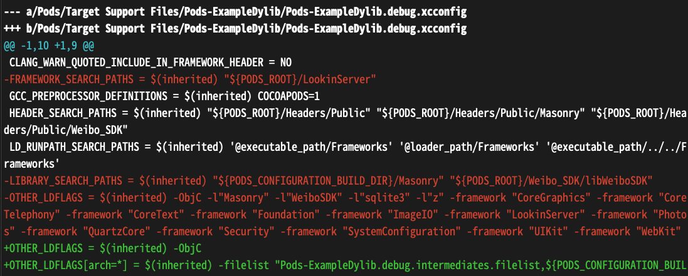

## cocoapods-link-filelist plugin

本插件会删除 `Pods/Target Support Files/<AggregateTarget>/*.xcconfig` 中的 `FRAMEWORK_SEARCH_PATHS` 与 `LIBRARY_SEARCH_PATHS`，将所有需要 link 的文件合并进一个 filelist 传递给 `OTHER_LDFLAGS` 之中。

前后对比：



对于大量二进制化组件的项目 link 速度有提升，但对于简单项目改善有限。


filelist example:

* Pods-ExampleDylib.debug.intermediates.filelist（源码 Pod 中间产物）

```
Masonry/libMasonry.a
```

* Pods-ExampleDylib.debug.system.filelist（系统库）

```
/usr/lib/libsqlite3.tbd
/usr/lib/libz.tbd
/System/Library/Frameworks/CoreGraphics.framework/CoreGraphics.tbd
/System/Library/Frameworks/CoreTelephony.framework/CoreTelephony.tbd
/System/Library/Frameworks/CoreText.framework/CoreText.tbd
/System/Library/Frameworks/Foundation.framework/Foundation.tbd
/System/Library/Frameworks/ImageIO.framework/ImageIO.tbd
/System/Library/Frameworks/Photos.framework/Photos.tbd
/System/Library/Frameworks/QuartzCore.framework/QuartzCore.tbd
/System/Library/Frameworks/Security.framework/Security.tbd
/System/Library/Frameworks/SystemConfiguration.framework/SystemConfiguration.tbd
/System/Library/Frameworks/UIKit.framework/UIKit.tbd
/System/Library/Frameworks/WebKit.framework/WebKit.tbd
```

* Pods-ExampleDylib.debug.vendored.filelist（二进制 Pod 自带的 .a .framework）

```
Pods/Weibo_SDK/libWeiboSDK/libWeiboSDK.a
Pods/LookinServer/LookinServer.framework/LookinServer
```